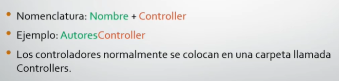
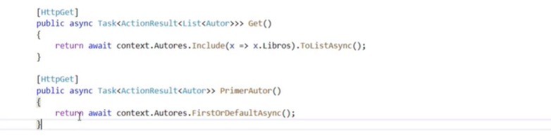
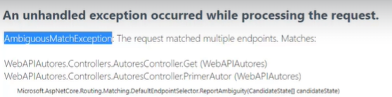
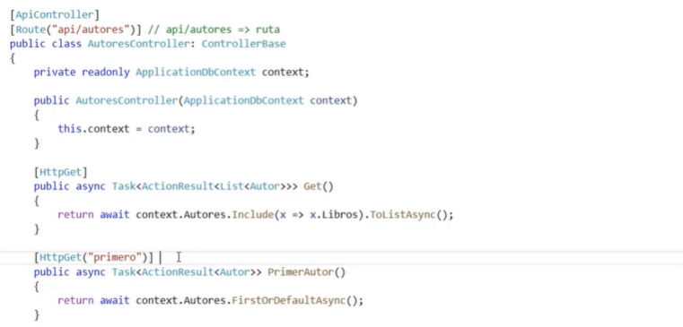
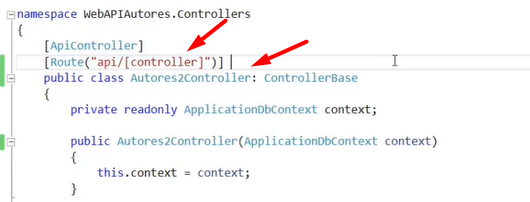
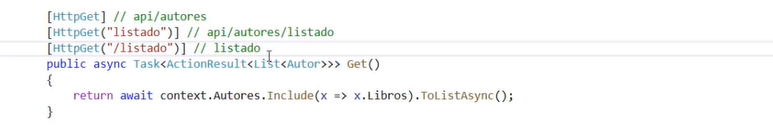
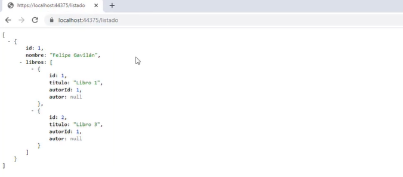

# Fundamentos de ASP.NET Core y Web API.

### Controladores y Acciones
La idea fundamental de tener una web API es que tendremos clientes que harán peticiones HTTP a nuestro web API.

Ejemplo: http://miapi.com/autores

Aquí la primera parte es tu dominio y *autores* es el recurso. 
Cuando hacemos una petición a nuestra ruta de nuestra web api, tipicamente se ejecutará una función del controlador, a esta función se le llamará acción o endpoint.
- Acción o endpoint:  es una función de un controlador que se ejecuta en respuesta a una petición HTTP realizada a nuestro web API. 
- Controlador: Es una clase que se agrupa a un conjunto de acciones. La siguiente imagen muestra su nomenclatura.

  

Es un Standar que la ruta de la API inicial se declare al principio *api*.
> [Route("api/autores")]

Suponiendo que tienes un cotrolador que ya tiene los métodos GET, POST, PUT Y DELETE, y vuelves a escribir un método get pero que haga otra funcionalidad.

Saldrá el siguiente error especificando que existen 2 endpoints que responden a la misma ruta.
*Error de relación ambigua*

La solución es sencilla, hay que darle una ruta diferente, es decir, se hará una operación de concatenación. A la ruta del controlador se le agrega la ruta que se especifica en el método (puede ser una palabra o hasta pasarle variables).

La ruta de esta API será de la siguiente manera: 
> api/autores/primero

### Reglas de Ruteo
Estas nos permiten mapear una ruta o url con un endpoint.
En un proyecto real api/**[controller]** actua como un placeholder y se reemplaza por el prefijo (es decir solo el primer nombre y Controller no lo toma) del nombre de la clase de tu controlador. 

Hay unos casos en los que se puede:
- El primero es el método normal
- Clonar la API solo asignandole una ruta diferente, pero hará la misma acción.
- Si se quiere una API que no esté dentro de la ruta del controlador, entonces solo agregar el */* adelante.
  

Salida:

